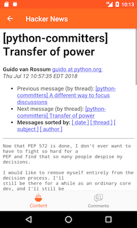

Hacker News
=========================
It is just another Hacker News Android app where I practice my skills with newest things.

Screenshots
-----------

Libraries Used
--------------
- [Android Architecture Components][1] - A collection of libraries that help you design robust, testable, and maintainable apps.
	* [Data Binding][1.1] - Allows you to bind UI components in your layouts to data sources in your app using a declarative format rather than programmatically.
	* [Lifecycles][1.2] - Create a UI that automatically responds to lifecycle events.
	* [LiveData][1.3] - Build data objects that notify views when the underlying data changes.
	* [Navigation][1.4] - Simplifies the implementation of navigation in an Android app.
	* [ViewModel][1.5] - Designed to store and manage UI-related data in a lifecycle conscious way.     
- [Material Design][2]
	* [BottomNavigationView][2.1] - Represents a standard bottom navigation bar for application.
	* [ConstraintLayout][2.2] - Allows you to create large and complex layouts with a flat view hierarchy (no nested view groups). 
	* [Support Library][2.3]
	* [Android Layouts][2.4]
	
- Third party libraries
	* [Retrofit2][3.1] - A type-safe HTTP client for Android and Java
	* [Dagger2][3.2] - A fully static, compile-time dependency injection framework for both Java and Android.
	* [RxJava2][3.3] - Reactive Extensions for the JVM – a library for composing asynchronous and event-based programs using observable sequences for the Java VM.
	* [RxKotlin][3.4] - RxJava bindings for Kotlin
  
TODO
-----------------
- [ ] Login
- [ ] Comment on a post
- [ ] Vote
- [ ] Make comments list expandable
- [ ] Filter news based on keywords and sources
- [ ] Add Unit Tests and Intrumented Tests
- [ ] Add CircleCI continus intergration
- [ ] Save news to read later
- [ ] Add notification for newest news (configurable, e.g. per day, twice a day)
- [ ] Swipe left to delete a new - Swipe right to add to read later
- [ ] Sharing
- [ ] Add licensess

Inspired by
-----------------
- [Android Sunflower][10.1]: A gardening app illustrating Android development best practices with Android Jetpack.
- [Android Architecture Components samples][10.2]: A collection of samples using the [Architecture Components][1]

[1]: https://developer.android.com/topic/libraries/architecture/
[1.1]: https://developer.android.com/topic/libraries/data-binding/
[1.2]: https://developer.android.com/topic/libraries/architecture/lifecycle
[1.3]: https://developer.android.com/topic/libraries/architecture/livedata
[1.4]: https://developer.android.com/topic/libraries/architecture/navigation/
[1.5]: https://developer.android.com/topic/libraries/architecture/viewmodel
[2]: https://material.io/design/
[2.1]: https://developer.android.com/reference/android/support/design/widget/BottomNavigationView
[2.2]: https://developer.android.com/training/constraint-layout/
[2.3]: https://developer.android.com/topic/libraries/support-library/
[2.4]: https://developer.android.com/guide/topics/ui/declaring-layout
[3.1]: https://square.github.io/retrofit/
[3.2]: https://google.github.io/dagger/
[3.3]: https://github.com/ReactiveX/RxJava
[3.4]: https://github.com/ReactiveX/RxKotlin

[10.1]: https://github.com/googlesamples/android-sunflower
[10.2]: https://github.com/googlesamples/android-architecture-components